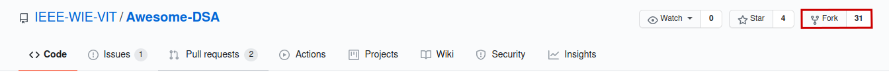
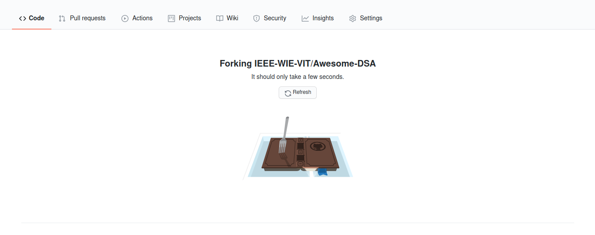
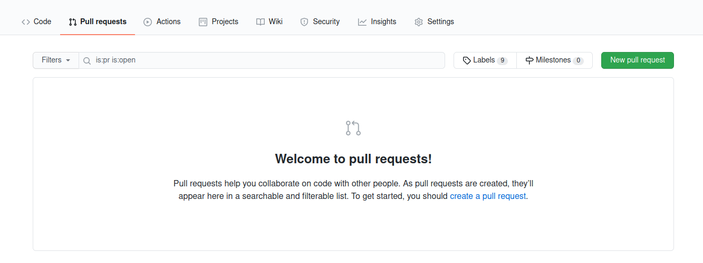
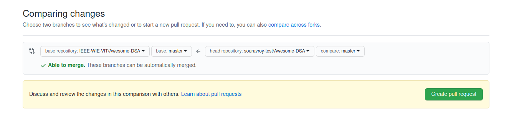
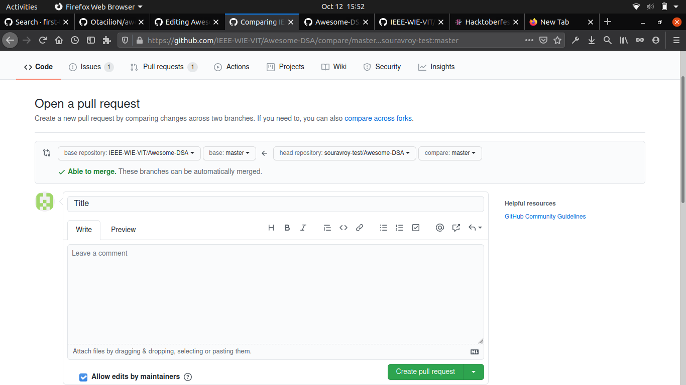

# Awesome-DSA
Contribute Data Structure and Algorithm related codes for Hacktoberfest 2020!


<p align="center">
    
   
   
   
   
</p>

## About

This repository contains various data structure and algorithm programs in different languages.

## Contribution Guidelines

- This repository is structured language wise. Inside a language folder there are 2 folders - `Data Structures` and `Algorithms`.
- The path for adding a file containing the program should be - ```language/Data Structures/name_of_the_data_Structure/Data Structures.extension``` or ```language/Algorithms/Algoname.extension```.
- For data structures you can include one functionality only naming and path in that case - ```language/Data Structures/LinkedList/LinkedListDeleteEnd.extension```.
-  If a folder corresponding to a Data Structures does not exist, then make a new one.
-  This is begineer's friendly repository, so if you make mistake in making a `pull request`(PR), members of WIE will help you out.
-  No repetition of programs will be entertained.
-  So go ahead make your first PR.

## How to make a PR

- Fork the repository to your account.
   
  Forking
   
- Add the changes on the forked repository
- GO to the `Pull requests` section and Press `New pull request` button.
   
- Compare the changes you make with the master repo, press `Create pull request` button.
   
- To merge the pull request, write a `Title`, `Leave a comment` and press `New pull request` button
   
- Wait for the maintainers to review and accept the PR.

## What To Do

### What is Hacktoberfest?
- Hacktoberfest  is a month long virtual festival event to celebrate open source contributions presented by Digital Ocean, Intel and DEV. It is the easiest way to get into open source!

- To earn your Hacktoberfest tee or tree reward, you must register and make four valid pull requests (PRs) between October 1-31 (in any time zone). PRs can be made to participating public repos on GitHub, those that have the Hacktoberfest topic. 

- This year, the first 70,000 participants who successfully complete the challenge will be eligible to receive a prize.

- It is open to everyone in our global community. Whether you’re a developer, student learning to code, event host, or company of any size, you can help drive growth of open source and make positive contributions to an ever-growing community. All backgrounds and skill levels are encouraged to complete the challenge.

### What is open source?
- It's never been easy to learn programming. But despite tons of ways to learn how to code, it is believed that the best way to improve your skills is by contributing to open source projects.

- The open source community provides a great opportunity for aspiring programmers to distinguish themselves; and by contributing to various projects, developers can improve their skills and get inspiration and support from like-minded people.

- To get started with open source contributions, you can search GitHub repositories labelled `` good first issue `` , `` first-timer issues `` or `` easy`` and start working on these issues.


